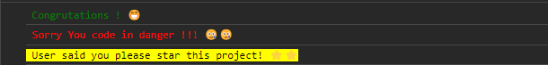

# Preetiraj colorify library

### How to use this library

### step 1. Install
```sh
npm i preetiraj-colorify
```

### step 2: Import in your project
```sh
import {Log} from 'preetiraj-colorify'
```

### Use in your code
```js
 useEffect(() => { 
    Log.success("Congrutations ! 😁")
    Log.danger("Sorry You code in danger !!! 🥲🥲")
    Log.info("User said you please star this project! ⭐⭐")
  }, [])
```

### How show your console in browser
